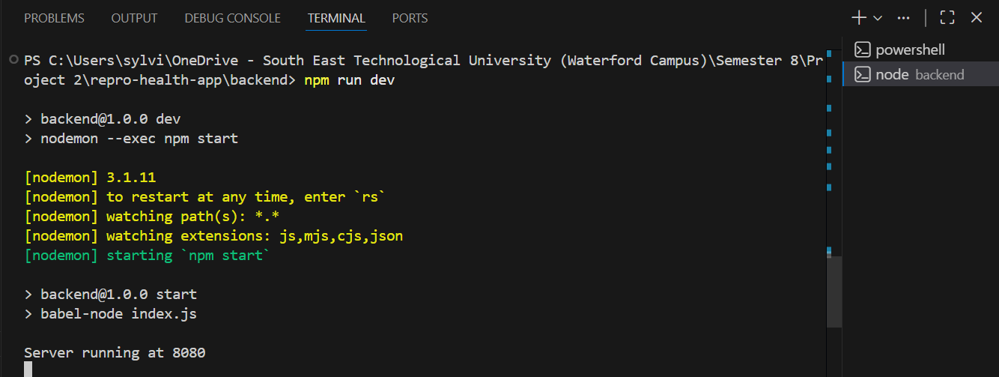
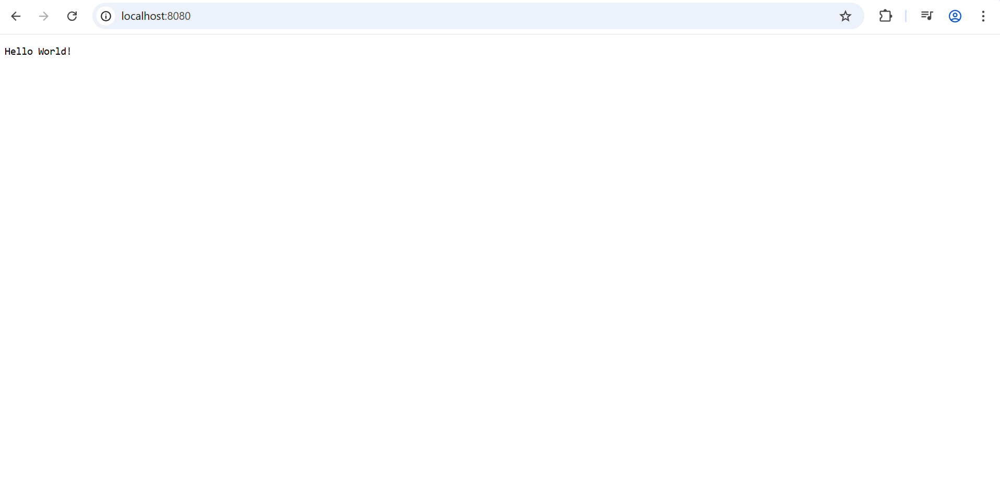
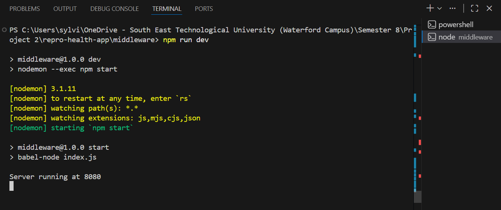
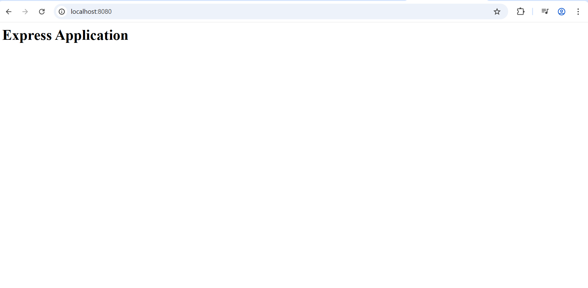
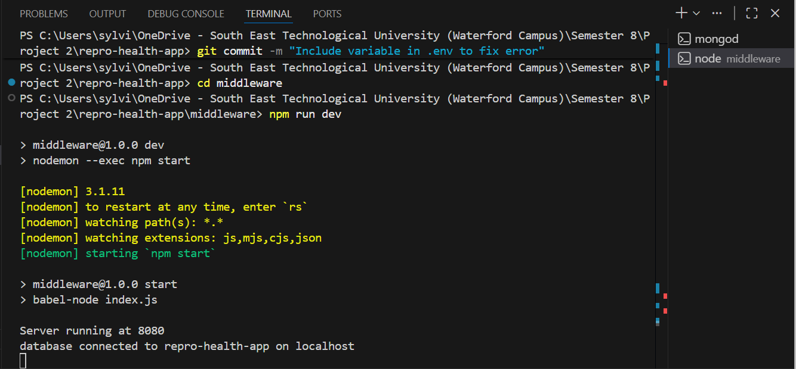
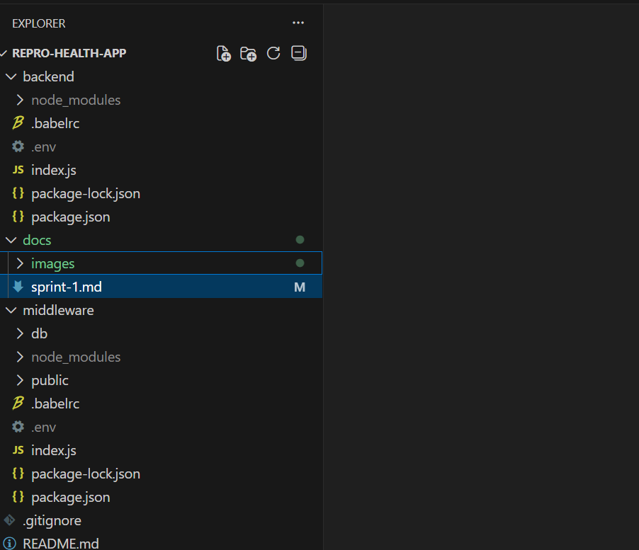

# Sprint One - Backend Setup

**Author:** Sylvia Martin  
**Project:** Reproductive Health Application  
**Sprint:** 1  
**Week:** 0  

## Overview
Sprint 1 focused on setting up the backend foundation of the reproductive health application. This involved creating a Node.js HTTP server, Express JS server, and MongoDB database connection, so that all of the components could work together. 

## Project Structure
- repro-health-app: the root directory of the project containing all its files and folders.
- backend: contains the Node.js server and all of its dependencies and config files.
- middleware: contains the Express server, database connection logic, and static content.
- docs: contains project documentation, including sprint reports. 

## Implementation
- Created a remote GitHub repository with a ReadMe and .gitignore file.
- Created a local repository and connected it to the remote repository.
- Set up the backend folder to represent the Node.js HTTP server.
- Created a package.json file in the backend folder using 'npm init'.
- Installed Babel, Nodemon, and Dotenv in the backend folder.
- Created a .env file to store environment variables which was excluded from version control.
- Created an index.js file which implemented a HTTP server using http.createServer.
- Set up the middleware folder to represent the Express server.
- Created a package.json file in the backend folder using 'npm init'.
- Installed Babel, Nodemon, and Dotenv in the middleware folder.
- Created a .env file to store environment variables which was excluded from version control.
- Created a public folder to store static content served by the Express application.
- Added an index.html file to the public folder to verify static file serving.
- Installed Mongoose in the Express app to handle data schemas.
- Created a db folder containing an index.js file to handle database connections and logic.

## Testing
- Ran the Node.js HTTP server and verified it responded correctly at http://localhost:8080.
- Ran the Express server and confirmed it served content from index.html in the browser.
- Started MongoDB and verified the Express server successfully connected to the database. 

## Running the Application
- Clone the repository to your machine.
- Install the necessary dependencies to run the application.
- Create a .env file containing environment variables like node environment, port, and host.
- Ensure MongoDb is running locally.
- Navigate to the middleware folder.
- Start the application using npm run dev. 

## Issues/Notes
- Mongoose schemas and frontend functionality are yet to be implemented.
- Encountered issues with GitHub workflow, particularly when deleting feature branches.
- Experienced error running Express app after implementing MongoDb connection, resolved this error by remembering to add MongoDB uri as an environment variable to .env file.

## Images/Screenshots
**Node.js server running in terminal**

**Node.js server response in browser**

**Express server running in terminal**

**Express server response in browser**

**MongoDB connection running in terminal**

**Sprint 1 application structure**

