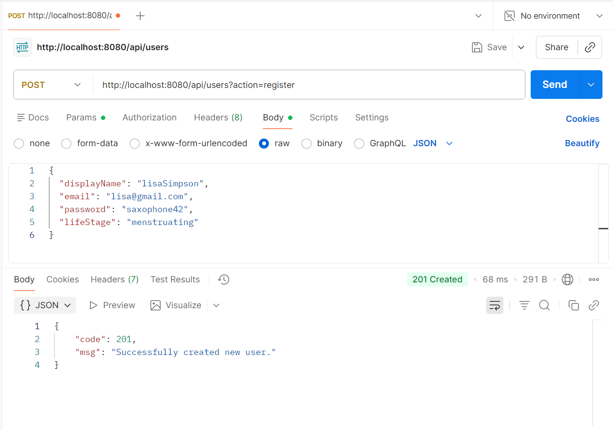
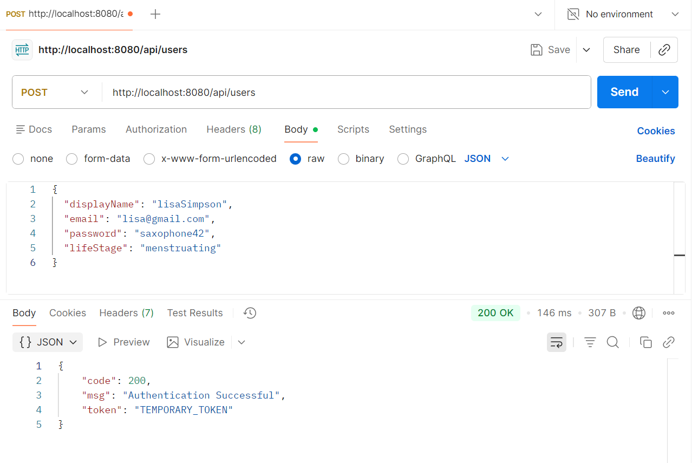
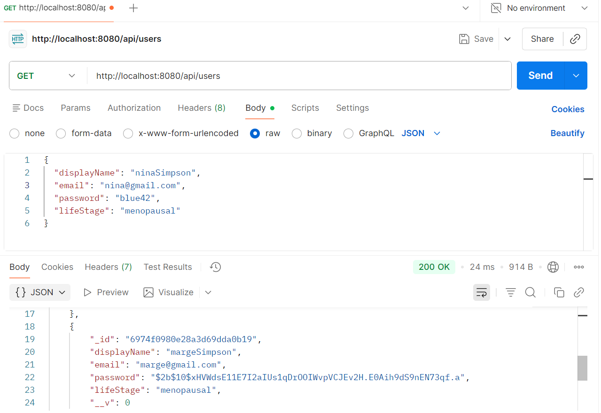
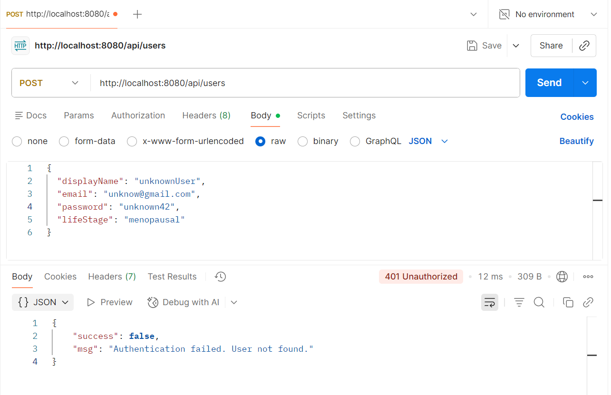
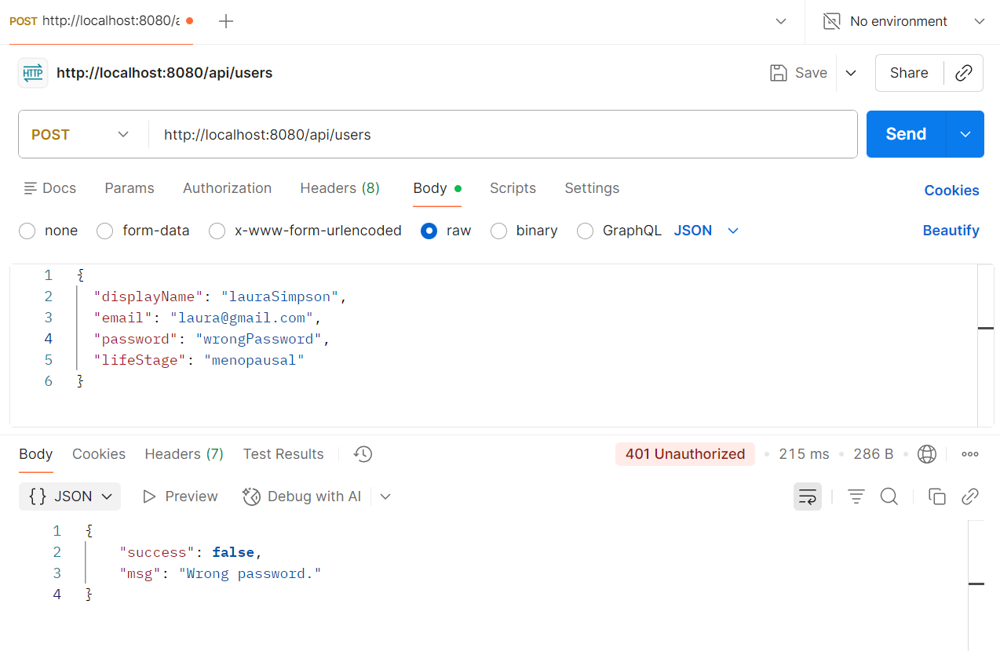
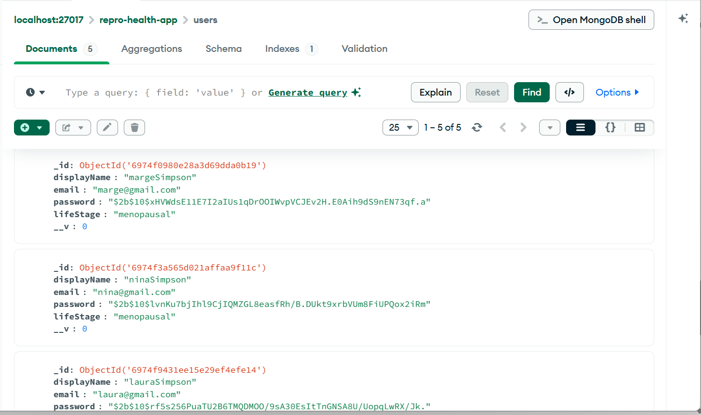
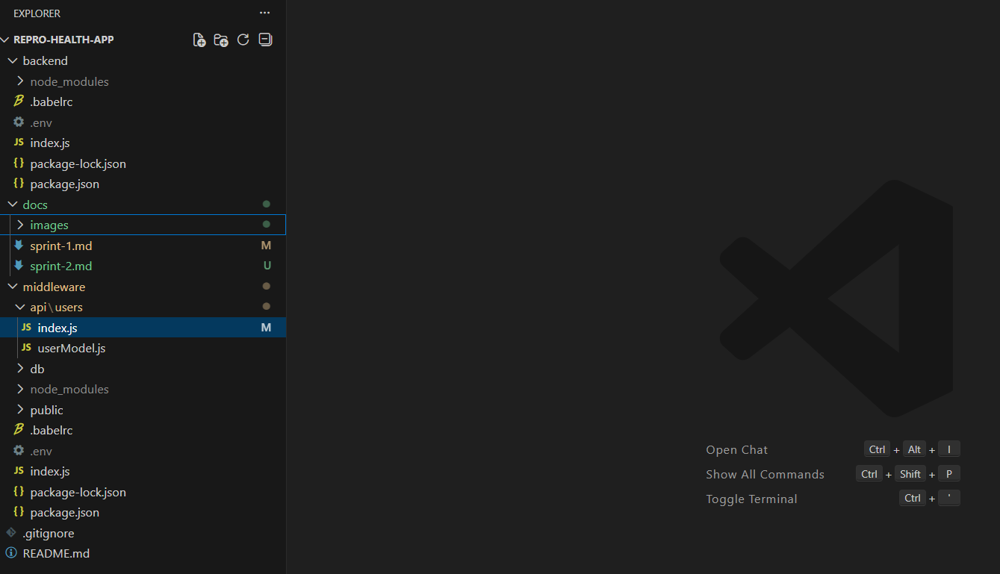

# Sprint Two - Authentication Setup

**Author:** Sylvia Martin  
**Project:** Reproductive Health Application  
**Sprint:** 2  
**Week:** 2 

## Overview
Sprint 2 focused on setting up authentication in the application. This involved creating a user model, functionality to register and authentication users, password encryption, and JWT tokens for session management.

## Project Structure
- repro-health-app: the root directory of the project containing all its files and folders.
- backend: contains the Node.js server and all of its dependencies and config files.
- middleware: contains the Express server, database, and authentication functionality.
- docs: contains project documentation, including sprint reports. 

## Implementation
- Created a user model with the fields displayName, email, password, lifeStage, height, weight.
- Created a user router with functions to register, authenticate, and get users.
- Implemented password encryption using bcrypt salting and hashing.
- Implemented JSON Web Tokens for secure user login sessions and authentication.
- Added validation to ensure passwords are eight characters long and have at least one alphanumeric character, digit, and special character.

## Testing
- Started the Express server and added users to the database in Postman.
- Created GET and POST requests in Postman and ensured correct results were seen.

## Running the Application
- Clone the repository to your machine.
- Install the necessary dependencies to run the application.
- Create a .env file containing environment variables like node environment, port, and host.
- Ensure MongoDb is running locally.
- Navigate to the middleware folder.
- Start the application using npm run dev. 

## Issues/Notes
- Frontend functionality is yet to be implemented.
- Issues with clashing between async function and next().

## Images/Screenshots
**Successful User Registration**

**Successful User Authentication**

**Encrypted Password**

**Wrong Credentials**

**Wrong Password**

**MongoDB Collection in Compass**

**Sprint 2 application structure**

