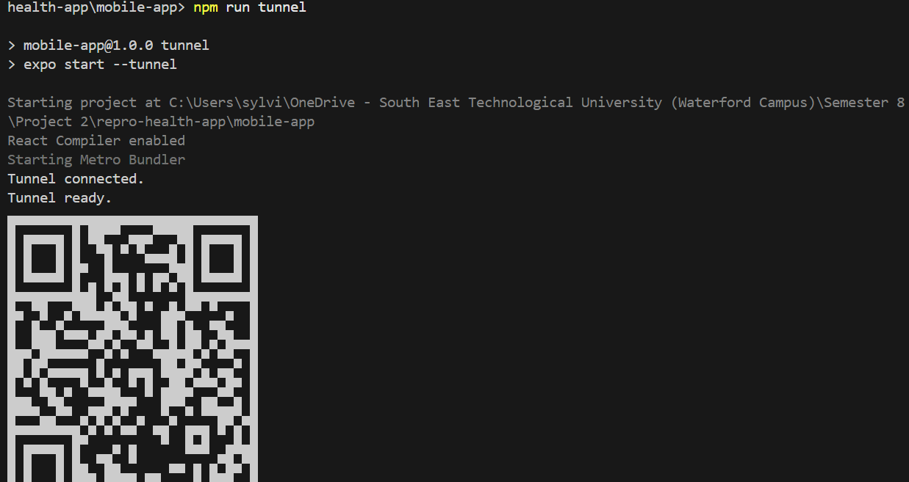
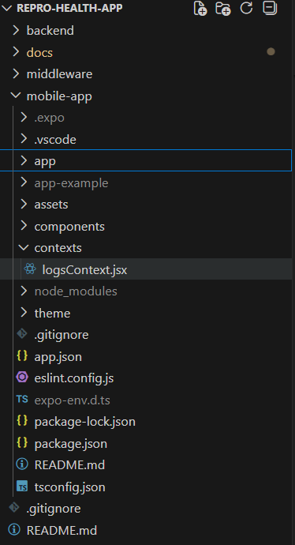

# Sprint Three - Frontend Setup

**Author:** Sylvia Martin  
**Project:** Reproductive Health Application  
**Sprint:** 3 
**Week:** 4 and 5

## Overview
Sprint 4 focused on expanding the functionality of the application. This involved implementing functionality for the logs to be saved to the database and expanding the logging functionality to include other attributes.

## Project Structure
- repro-health-app: the root directory of the project containing all its files and folders.
- backend: contains the Node.js server and all of its dependencies and config files.
- middleware: contains the Express server, database, and authentication functionality.
- mobile-app: contains the React Native files and Expo server. 
- docs: contains project documentation, including sprint reports. 

## Implementation
- Implemented functionality to allow the logs to be saved to the mongo database.
- Added attribute to the log component and form functionality to allow users to log their period start dates.
- Added attribute to the log component and form functionality to allow users to log their period end dates.
- Added attribute to the log component and form functionality to allow users to log their period pain levels.
- Added attribute to the log component and form functionality to allow users to log their period symptoms.
- Added attribute to the log component and form functionality to allow users to log their period emotions.

## Testing
- Ran npm web to view the app in browser and npm run tunnel to view the app on mobile and ensured the correct results were outputted for both.

## Running the Application
### Backend
- Clone the repository to your machine.
- Install the necessary dependencies to run the application.
- Create a .env file containing environment variables like node environment, port, and host.
- Ensure MongoDb is running locally.
- Navigate to the middleware folder.
- Start the application using npm run dev. 

### Frontend
- Ensure you have Expo Go app.
- Navigate to the 'mobile-app' folder.
- Scan QR code using Expo Goapp if you have Android device and camera if you have iOS device.
- Wait for application to download in Expo Go app.

## Issues/Notes
- Articles and supplements screens yet to be implemented.
- Issues with saving logs to database on phone.

## Images/Screenshots
**Start Screen**

**Register Screen**

**Login Screen**

**Dashboard Screen**

**Stats Screen**

**npm run tunnel command working**

**Sprint 3 application structure**

